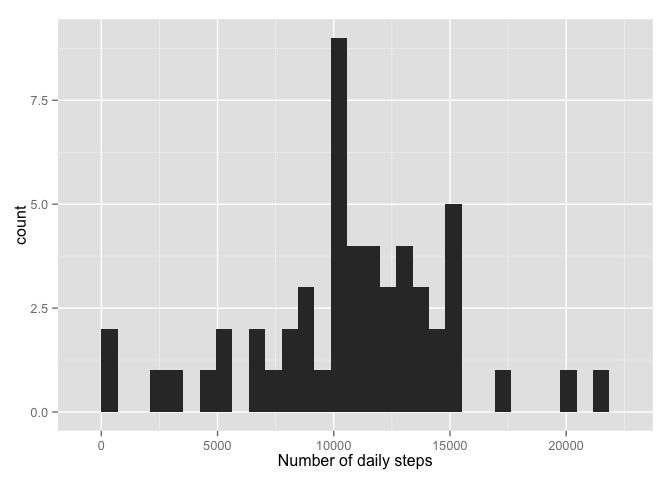

# Reproducible Research: Peer Assessment 1


```
## 
## Attaching package: 'dplyr'
## 
## The following object is masked from 'package:stats':
## 
##     filter
## 
## The following objects are masked from 'package:base':
## 
##     intersect, setdiff, setequal, union
```
## Loading and preprocessing the data  
(1) Load the data  

```r
df <- read.csv("activity.csv")
```
(2) Process/transform

```r
df <- df %>% 
        mutate(date = ymd(date)) %>%
        mutate(interval = str_pad(interval, 4, pad="0")) %>%
        mutate(interval = sub("(^\\d\\d)", "\\1:", interval)) %>%
        mutate(interval = parse_date_time(interval, "%H:%M"))
head(df)
```

```
##   steps       date            interval
## 1    NA 2012-10-01 0000-01-01 00:00:00
## 2    NA 2012-10-01 0000-01-01 00:05:00
## 3    NA 2012-10-01 0000-01-01 00:10:00
## 4    NA 2012-10-01 0000-01-01 00:15:00
## 5    NA 2012-10-01 0000-01-01 00:20:00
## 6    NA 2012-10-01 0000-01-01 00:25:00
```


## What is mean total number of steps taken per day?

(1) The total number of steps taken per day is as shown in the following chart, for the first five days, at least:  

```r
dfp <- df %>% 
        filter(!is.na(steps)) %>% 
        group_by(date) %>%
        summarize(total_steps = sum(steps))
print(head(dfp))
```

```
## Source: local data frame [6 x 2]
## 
##         date total_steps
## 1 2012-10-02         126
## 2 2012-10-03       11352
## 3 2012-10-04       12116
## 4 2012-10-05       13294
## 5 2012-10-06       15420
## 6 2012-10-07       11015
```
(2) A histogram showing this data is as follows:  

```r
qplot(data = dfp, x = total_steps, xlab = "Number of daily steps")
```

```
## stat_bin: binwidth defaulted to range/30. Use 'binwidth = x' to adjust this.
```

 

(3) The average number of steps taken per day is 10766 and the median is 10765 as can be seen in the summary table below.  

Mean:  

```r
as.integer(mean(dfp$total_steps))
```

```
## [1] 10766
```
Median:  

```r
quantile(dfp$total_steps, probs = 0.5)
```

```
##   50% 
## 10765
```
Summary Table:  

```r
summary(dfp)
```

```
##       date                      total_steps   
##  Min.   :2012-10-02 00:00:00   Min.   :   41  
##  1st Qu.:2012-10-16 00:00:00   1st Qu.: 8841  
##  Median :2012-10-29 00:00:00   Median :10765  
##  Mean   :2012-10-30 17:12:27   Mean   :10766  
##  3rd Qu.:2012-11-16 00:00:00   3rd Qu.:13294  
##  Max.   :2012-11-29 00:00:00   Max.   :21194
```

## What is the average daily activity pattern?  
(1) The time series plot of the average number of steps taken by time interval across the number of days is as follows:  

```r
dfs <- df %>% 
        filter(!is.na(steps)) %>% 
        group_by(interval) %>% 
        summarize(avg_steps=mean(steps))
qplot(data = dfs, x = interval, y = avg_steps, geom = "line", ylab = "Average number of steps per day", xlab = "Time interval") + 
        scale_x_datetime(labels = date_format("%H:%M"))
```

 

(2) The time interval containing the maximum number of steps is 08:35.

```r
dfs %>% filter(avg_steps == max(avg_steps)) %>% mutate(interval = format(interval, "%H:%M")) %>% select(interval)
```

```
## Source: local data frame [1 x 1]
## 
##   interval
## 1    08:35
```

## Imputing missing values  
(1) The number of missing values in the dataset is 2304.

```r
nrow(filter(df, is.na(steps)))
```

```
## [1] 2304
```
(2) To impute the missing values, I will apply the mean for the time of day across all days.  

```r
dfn <- left_join(df, dfs, by=c("interval"="interval")) %>%
        do(mutate(., steps = ifelse(is.na(steps), avg_steps, steps))) %>%
        select(-avg_steps)
```
[See here for usage of "do" in mutate](https://github.com/hadley/dplyr/issues/464)  
(3) Create a histogram of the total number of steps taken each day.

```r
dfp2 <- dfn %>% 
        group_by(date) %>%
        summarize(total_steps = sum(steps))
print(head(dfp2))
```

```
## Source: local data frame [6 x 2]
## 
##         date total_steps
## 1 2012-10-01    10766.19
## 2 2012-10-02      126.00
## 3 2012-10-03    11352.00
## 4 2012-10-04    12116.00
## 5 2012-10-05    13294.00
## 6 2012-10-06    15420.00
```

A histogram showing this data is as follows:  

```r
qplot(data = dfp2, x = total_steps, xlab = "Number of daily steps")
```

```
## stat_bin: binwidth defaulted to range/30. Use 'binwidth = x' to adjust this.
```

 

## Are there differences in activity patterns between weekdays and weekends?  
(1) Create a variable for weekdays vs. weekends  

```r
dfl <- df %>% 
        filter(!is.na(steps)) %>% 
        mutate(weekday = ifelse(wday(date, label = TRUE) %in% c("Sat", "Sun"), "weekend", "weekday")) %>%
        group_by(interval, weekday) %>%
        summarize(mean_steps = mean(steps))
```
(2) Panel plot of time series across weekdays or weekends  

```r
xyplot(mean_steps ~ interval | weekday, data=dfl, layout=c(1,2), type="l")
```

 
